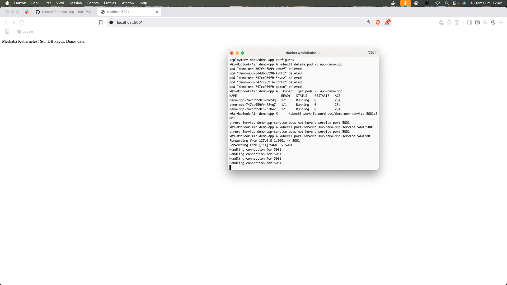

Flask uygulaması ve SQLite DB ile temel app geliştirdim.
Dockerfile ile uygulamanı containerize ettim.
Kubernetes manifestleri (deployment, service, hpa, pdb, crd, configmap, pvc, networkpolicy) yazdım ve uyguladım.
Pod affinity/anti-affinity, autoscaling, custom metrics, CRD, PDB, NetworkPolicy, PVC gibi ileri seviye Kubernetes özelliklerini test ettim.
CI/CD pipeline için GitHub Actions workflow klasörünü ve dosyasını doğru yere ekledim.

*. Network Policy Güvenliği
	1.	Aynı namespace'de iki farklı label'lı pod (örn. frontend, backend) çalıştır.
	2.	networkpolicy.yaml ile sadece frontend → backend trafiğine izin ver; diğer tüm trafiği engelle.
	3.	Busybox test pod'ları ile hem izinli hem engelli istekleri göster.
